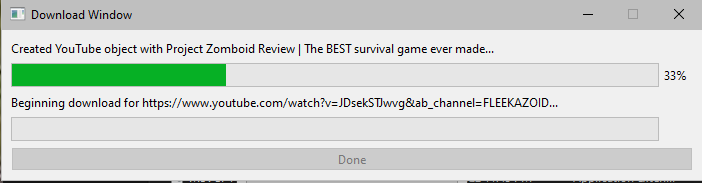

# YouToo

Program that downloads YouTube videos for the purpose of quick and easy media acquisition.

## Setup

Check releases and download the release that you want to use. 

For the executable version, download the `YouToo.zip` file from the [latest release](https://github.com/williamsantosa/YouToo/releases).

To run using Python, ensure that you have Python v3.10.5+. If python is outdated or not installed on your system, follow these steps for [Windows](https://www.python.org/downloads/) and for [Unix](https://docs.python.org/3/using/unix.html) respectively. 

Afterward, install the dependencies via using `pip` or another Python package installer. Alternatively, run the program via the Poetry package manager.

## Usage

1. To open the graphical user interface:
   1. For the executable, unzip the file anmd find `dist/YouToo/YouToo.exe` and run the program.
   2. If poetry is installed, run via the command `poetry run python YouToo.py`.
   3. Else, run via `python YouToo.py` after installing dependencies.
2. Enter a valid YouTube link containing a public video/playlist.
3. Select an output directory for the files to be downloaded to.
4. Enter the file name and the downloaded video's extension.
5. Select both, audio only, or video only, depending on your preference.

### Visual Guide

## Notes

1. If a playlist is provided the file name entered will be ignored. Download videos sequentially to name each one, or download all then rename them.
2. If no streams with the extension is found, an error message will appear. Select another extension and try again.

## Dependencies

| Package | Version |
| ------- | ------- |
| Python  | 3.10.5  |
| PyTube  | 12.1.0  |
| PyQt6   | 6.3.1   |